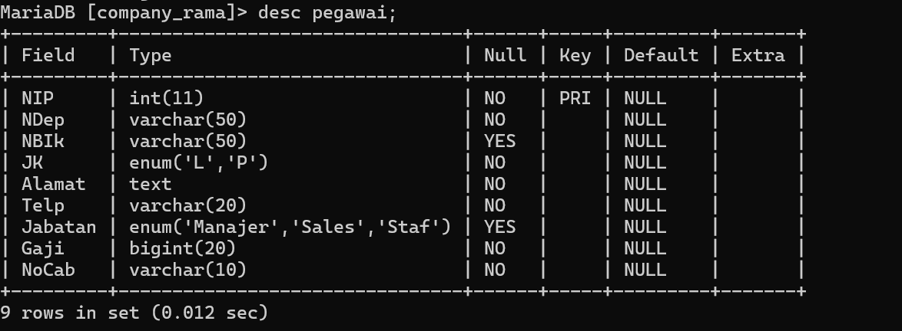
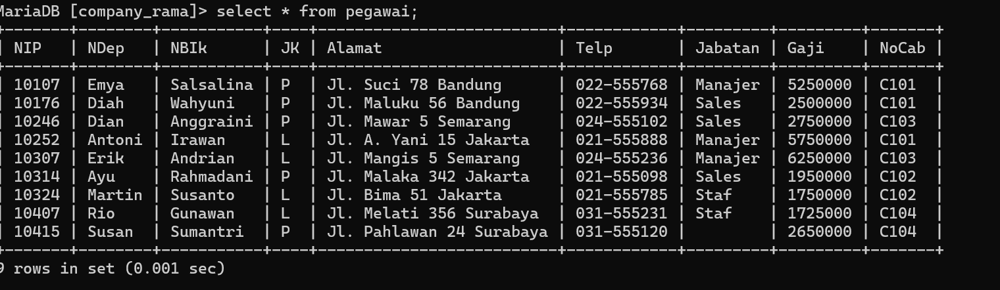

# DESC
*STRUKTUR "*
SQL
CREATE TABLE pegawai (
-> NIP INT PRIMARY KEY,
-> NDep VARCHAR(255) NOT NULL,
-> NBlk VARCHAR(255),
-> JK ENUM('L', 'P') NOT NULL,
-> Alamat TEXT NOT NULL,
-> Telp VARCHAR(255) NOT NULL,
Jabatan ENUM('Manager', 'Supervisor', 'Staff'),
    Gaji BIGINT NOT NULL,
    NoCab VARCHAR(255) NOT NULL
);

*PENJELASAN :*
- *NIP INT PRIMARY KEY*:
    - *NIP*: Kolom ini menyimpan Nomor Induk Pegawai yang bertipe data integer (INT).
    - *PRIMARY KEY*: Menandakan bahwa kolom NIP adalah kunci utama dari tabel ini. Kunci utama harus memiliki nilai yang unik untuk setiap baris dan tidak boleh NULL.
    
- *NDep VARCHAR(255) NOT NULL*:
    - *NDep*: Kolom ini menyimpan Nama Depan pegawai bertipe data string dengan panjang maksimum 255 karakter (VARCHAR(255)).
    - *NOT NULL*: Menandakan bahwa kolom ini tidak boleh berisi nilai kosong (NULL); artinya, setiap baris harus memiliki nilai untuk kolom ini.
    
- *NBlk VARCHAR(255)*:
    - *NBlk*: Kolom ini menyimpan Nama Belakang pegawai bertipe data string dengan panjang maksimum 255 karakter (VARCHAR(255)).
    - Kolom ini tidak memiliki batasan NOT NULL, sehingga nilai kosong (NULL) diizinkan.
    
- *JK ENUM('L', 'P') NOT NULL*:
    - *JK*: Kolom ini menyimpan Jenis Kelamin pegawai dengan tipe data ENUM. Hanya dua nilai yang diperbolehkan: 'L' (Laki-laki) atau 'P' (Perempuan).
    - *NOT NULL*: Menandakan bahwa kolom ini tidak boleh kosong; artinya, setiap baris harus memiliki nilai untuk kolom ini.

- *Alamat TEXT NOT NULL*:
    - *Alamat*: Kolom ini menyimpan alamat pegawai dengan tipe data TEXT, yang bisa menampung teks dalam jumlah besar.
    - *NOT NULL*: Menandakan bahwa kolom ini harus diisi dengan nilai; nilai kosong (NULL) tidak diperbolehkan.

- *Telp VARCHAR(255) NOT NULL*:
    - *Telp*: Kolom ini menyimpan nomor telepon pegawai dengan tipe data string dan panjang maksimum 255 karakter (VARCHAR(255)).
    - *NOT NULL*: Menandakan bahwa kolom ini harus diisi; nilai kosong (NULL) tidak diperbolehkan.
    
- *Jabatan ENUM('Manager', 'Supervisor', 'Staff')*:
    - *Jabatan*: Kolom ini menyimpan jabatan pegawai dengan tipe data ENUM. Nilai yang diperbolehkan adalah 'Manager', 'Supervisor', atau 'Staff'.
    - Kolom ini tidak memiliki batasan NOT NULL, sehingga nilai kosong (NULL) diizinkan.
    
- *Gaji BIGINT NOT NULL*:
    - *Gaji*: Kolom ini menyimpan gaji pegawai dengan tipe data BIGINT, yang dapat menampung bilangan bulat yang sangat besar.
    - *NOT NULL*: Menandakan bahwa kolom ini harus diisi; nilai kosong (NULL) tidak diperbolehkan.
    
- *NoCab VARCHAR(255) NOT NULL*:
    - *NoCab*: Kolom ini menyimpan nomor cabang pegawai dengan tipe data string dan panjang maksimum 255 karakter (VARCHAR(255)).
    - *NOT NULL*: Menandakan bahwa kolom ini harus diisi; nilai kosong (NULL) tidak diperbolehkan.

*HASIL :*

# SELECT
**Penjelasan :** Perintah `SELECT` dalam MySQL digunakan untuk mengambil data dari tabel dalam database. Ini adalah perintah dasar dan paling sering digunakan dalam SQL untuk menampilkan data. Anda bisa menggunakan `SELECT` untuk memilih kolom tertentu, menggabungkan tabel, melakukan filter data, dan banyak lagi.

**Contoh :**
~~~sql
select * from pegawai;
~~~

**Hasil :**

**Kesimpulan :**
Perintah `SELECT * FROM pegawai;` berguna untuk melihat seluruh data dalam tabel `pegawai` tanpa batasan atau filter. Ini adalah cara cepat untuk mendapatkan gambaran lengkap tentang data yang ada di tabel, tetapi untuk analisis yang lebih spesifik atau untuk meningkatkan performa query, sebaiknya Anda memilih kolom tertentu dan menerapkan kondisi yang sesuai.